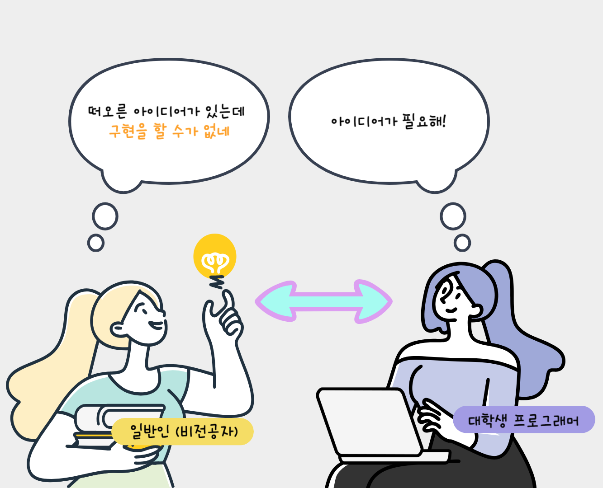

# 일반인과 대학생 프로그래머를 위한 아이디어 공유 웹/앱 개발 제안

## 1. 개요
아이디어에 늘 목마른 대학생 프로그래머와 좋은 아이디어를 가지고 있으나 구현에
이르지 못하는 비전공자(일반인)의 니즈를 모두 충족하는 것을 목표로 하는 **아이디어 공유 플랫폼**입니다.

일반인들에게는 본인의 아이디어가 실현으로 이루어질 수 있다는 *성취감*을 안겨줄 수 있고, 프로그래머들에게는 *포트폴리오를 풍성하게* 할 수 있는 기회가 될 수 있습니다.

## 2. 필요한 기술
+ 프론트엔드 (html, css, javascript)
+ 백엔드 (Node.js)
+ 데이터베이스 (SQLite)

node.js doucumentation 참고 링크 : <https://nodejs.org/docs/latest/api/https.html>

## 3. 대표 그림

